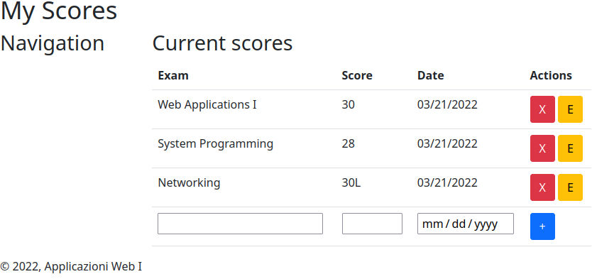

# Esercizio 4.1 - Contenuto

Preparare una pagina web statica (usando HTML) che rappresenti un insieme di esami e voti (cioe' la struttura dati degli esercizi precedenti)

La pagina deve visualizzare una lista di esami, con il loro voto. Per il momento, i dati (nome corso e voti) saranno scritti in maniera fissa e statica nel codice HTML.

Si cerchi il piu' possibile di usare gli elementi "semantici" per delimitare le varie parti di pagina inserendo una parte di intestazione e una parte a fondo pagina (es. dicitura di copyright o simile)

# Esercizio 4.2 - Applicazione dello stile

Definire un layout ragionevole, usando CSS e Bootstrap, per la pagina HTML sviluppata precedentemente.

Aggiungere una barra laterale, che possa contenere (future) opzioni di navigazione.

# Esercizio 4.3 - Controlli

Aggiungere dei bottoni/forms, che consentano di editare (modificare/cancellare) l'esame corrente ed aggiungerne uno nuovo (al momento non funzionanti).

Esempio:

